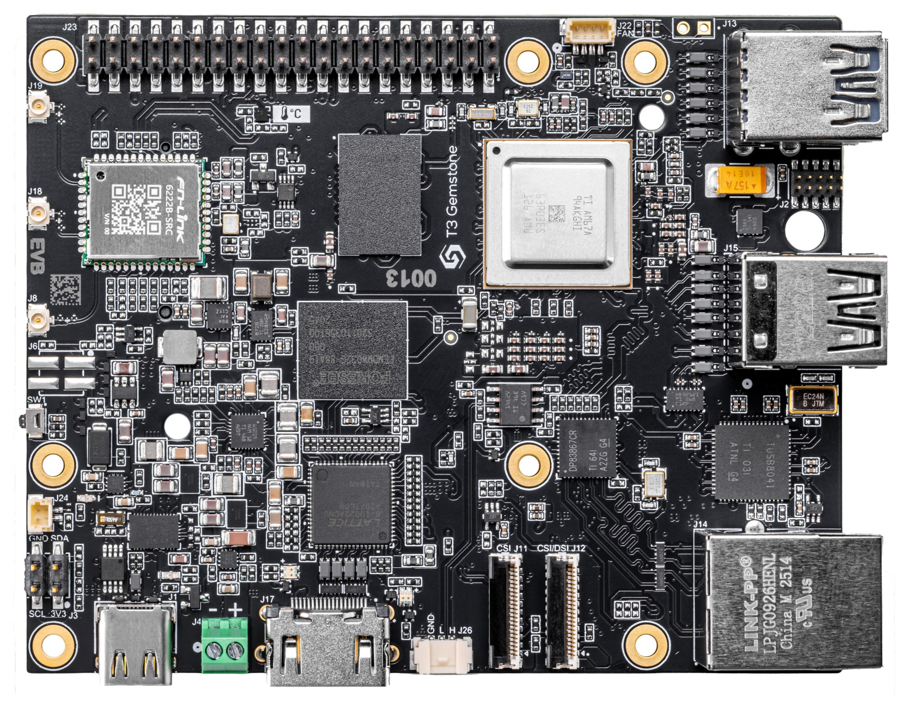
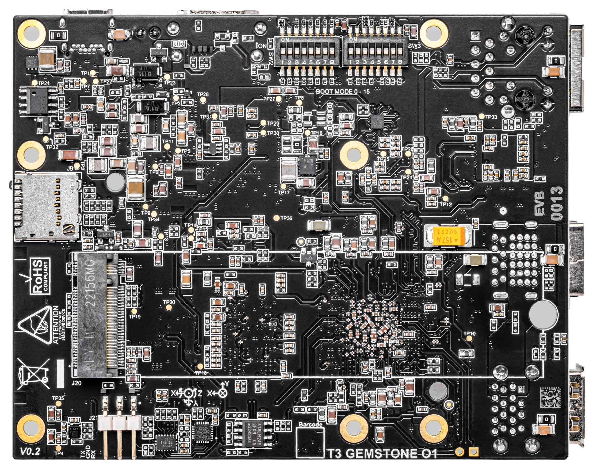
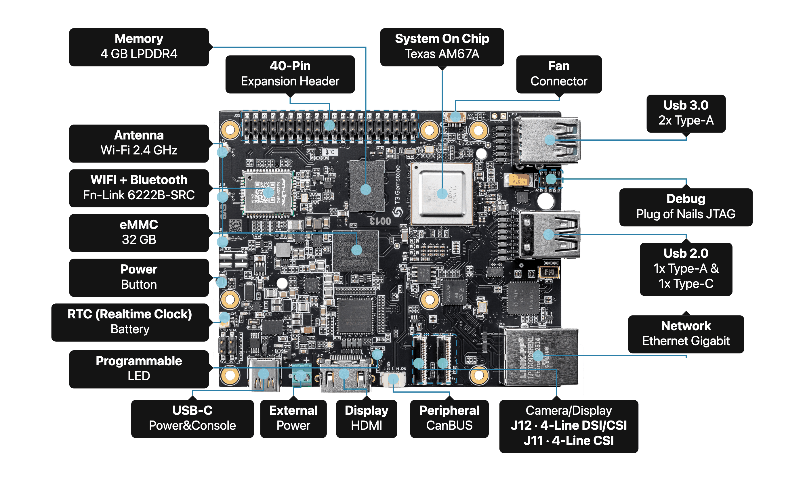
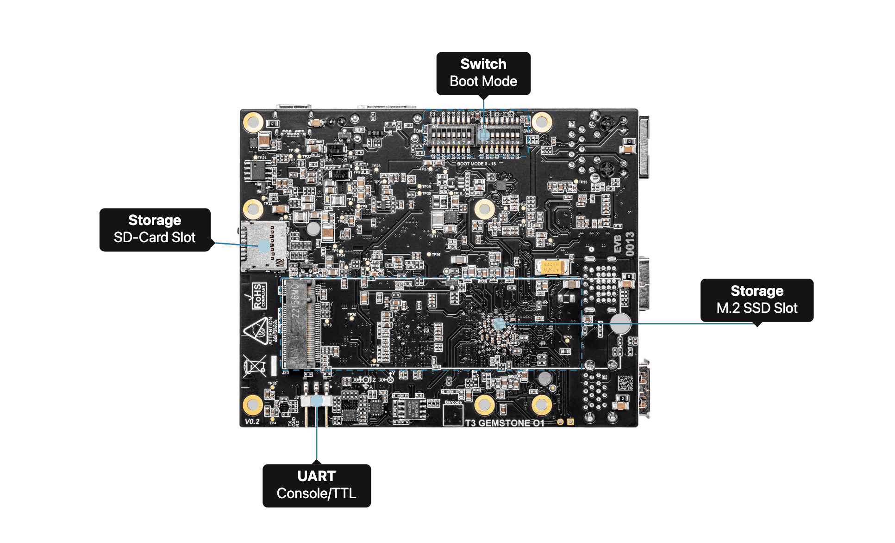
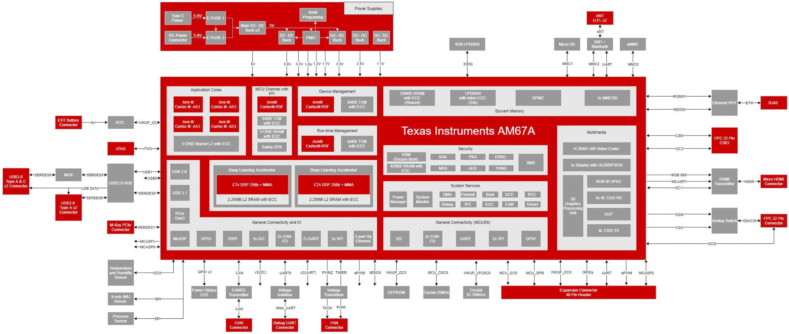
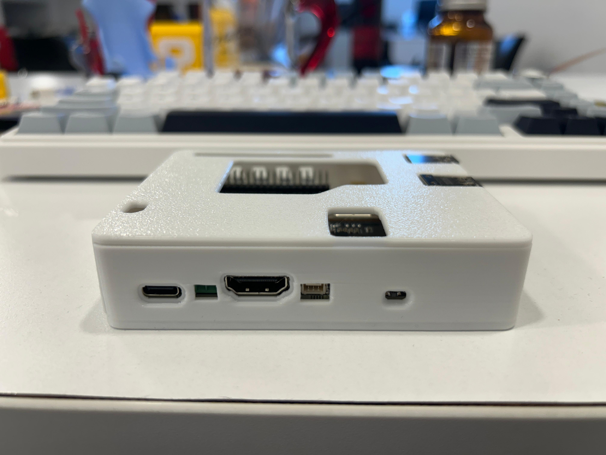

# T3 Gemstone O1

T3 Gemstone O1 is a high-performance **64-bit quad-core single board computer** designed for **AI, vision, and embedded edge applications**.  
It integrates **GPU**, **DSP**, and **dedicated AI accelerators** for demanding workloads while maintaining low power consumption.

  
  

> 🔗 Learn more or purchase at [t3gemstone.org](https://t3gemstone.org)

---

## Overview

The T3 Gemstone O1 is an all-in-one embedded platform built for developers, researchers, and industrial applications requiring advanced multimedia, connectivity, and AI capabilities.  
With a 64-bit ARM architecture and TI system-on-chip foundation, it offers rich interfaces for sensors, cameras, and displays — making it ideal for **robotics**, **computer vision**, and **edge AI systems**.

---

## Features

| Feature | Description |
|----------|--------------|
| **Processor** | Quad-core ARM Cortex-A53 @1.4 GHz with integrated GPU DSP and AI accelerators |
| **Memory** | 4 GB LPDDR4 RAM |
| **Wi-Fi** | Wi-Fi 5 — 802.11a/b/g/n/ac dual-band 2.4/5 GHz, 2x2 MIMO up to 867 Mbps (Fn-Link 6222B-SRC, Realtek RTL8822CS) |
| **Bluetooth** | Bluetooth 5.0 (BLE) |
| **Onboard Storage** | 32 GB onboard eMMC (High-speed onboard flash storage) , 512Kbit EEPROM (I2C-compatible serial EEPROM for configuration storage) |
| **Storage** | microSD slot (Supports high-speed SDR104 mode), M.2 2280 SSD Port (Supports high-capacity NVMe SSD) |
| **USB Ports** | 2 × USB 3.0 Type-A (5 Gbps), 1 × USB 2.0 Type-A, 1 × USB 2.0 Type-C (Device + PD support) |
| **Ethernet** | Gigabit Ethernet |
| **Display / Camera** | 1 x 4-lane MIPI camera/display transceivers (Supports wide range of touch displays such as Raspberry Pi 7” or Waveshare 7” and 10.1” displays) , 1 x 4-lane MIPI camera  (Supports wide range of camera modules such as Raspberry Pi Camera V2) |
| **Display Output** | 1 x HDMI display |
| **Expansion Connector** | 40-pin GPIO Header (Default pinout is compatible with Raspberry Pi) |
| **JTAG Connect** | 1 x JTAG (ARM Cortex 10-pin JTAG connector for debugging Cortex-R5 MCU cores) |
| **Real-time Clock (RTC)** | Maxim DS1340 (I2C RTC module with external battery connector (2-pin JST SH)) |
| **CAN Bus** | CAN FD transceiver for automotive applications |
| **Debug UART** | 3-pin 2.54mm connector provides access to serial console for debugging and system management |
| **Power** | USB Type-C Power (5-9V / 3A), DC Power Connector (5-12V / 5A) |
| **Power button** | On/Off included |
| **Fan connector** | 4-pin JST SH connector for active cooling solutions with PWM fan control |
| **Boot Mode Switch** | Hardware switch for selecting different boot modes and configurations |
| **Motion Sensing Sensor** | InvenSense ICM-20948 (9-Axis MEMS MotionTracking sensor with accelerometer, gyroscope, and magnetometer) |
| **Environmental Monitoring Sensors** | Bosch BMP390 (24-bit barometric pressure sensor) , TI HDC2010 (Humidity and temperature sensor) |

---

## Hardware Layout

### Front View

### Back View

---

## System Architecture

---

## T3 Gemstone O1 Protective Case

You can access a box design that can be printed with a 3D printer from the file [3d-printer/t3-gem-o1-protective-case.zip](3d-printer/t3-gem-o1-protective-case.zip)

## Community and Support

We welcome contributions, community projects, and feedback!  
Visit our [Community](https://community.t3gemstone.org) or contact us via [support@t3gemstone.org](mailto:support@t3gemstone.org)
